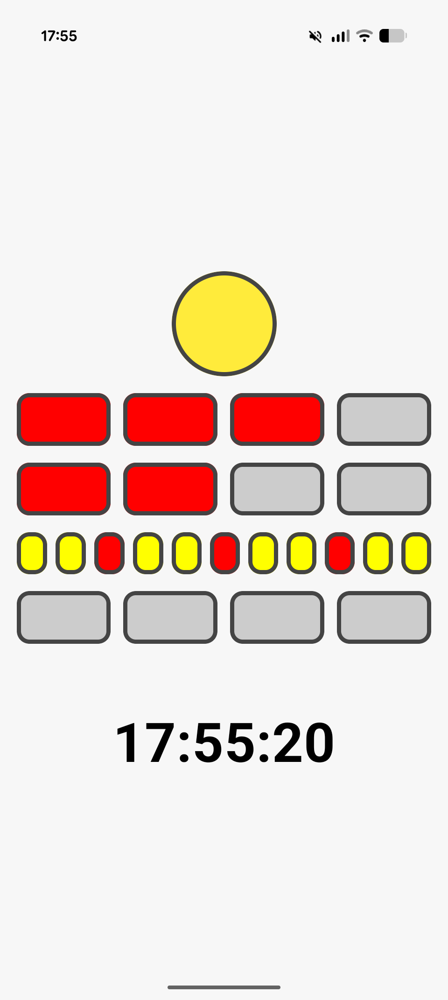
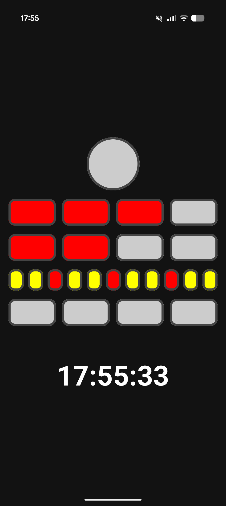

# Berlin Clock (Mengenlehreuhr)

Android implementation of the Berlin Clock using Kotlin, Jetpack Compose, MVVM, and Test-Driven Development.

---

## Overview

The Berlin Clock (Mengenlehreuhr) represents time using illuminated colored lamps arranged in rows:

- Top circle: seconds (yellow, blinking every 2 seconds)
- 1st row: five-hour blocks (4 red lamps)
- 2nd row: one-hour blocks (4 red lamps)
- 3rd row: five-minute blocks (11 lamps, quarter markers in red)
- 4th row: one-minute blocks (4 yellow lamps)

A synchronized digital time display is shown below the clock.

---

## Architecture

The project follows a simple layered structure:

### Domain
Contains pure business logic:
- `BerlinClockMapper`
- `Lamp`
- `BerlinClockState`

Characteristics:
- No Android framework dependencies
- Fully unit tested
- Deterministic mapping from `LocalTime` to `BerlinClockState`

### Presentation
- `BerlinClockViewModel`
- Jetpack Compose UI components

The ViewModel exposes a `StateFlow<BerlinClockState>` that updates every second.

---

## Test-Driven Development

The Berlin Clock mapping logic was implemented using TDD:

1. Add a failing unit test
2. Implement minimal logic to pass
3. Refactor
4. Repeat

Covered cases include:
- Midnight (`00:00:00`)
- Odd/even seconds
- Hour rows logic
- Minute rows logic
- Quarter minute markers (3, 6, 9)
- Edge case (`23:59:59`)

Run tests:

```bash
./gradlew test
```


## Screenshots

### Light Mode


### Dark Mode
